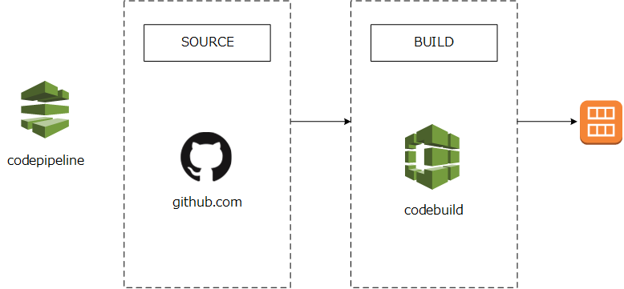
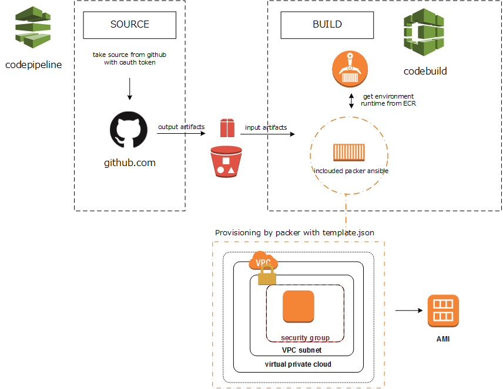
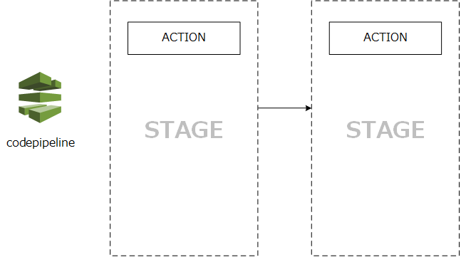

# build-custom-ami-terraform

## outline

`packer`から`ansible`を呼び出し、`github`上にあるコードでサーバー・プロビジョニングを行ったEC2 instanceからAMIを作成するための`codepipeline`(CI/CDサービス)などのAWS resourceを`terraform`で構築するためのコードのリポジトリ。

## detail flow

## about codepipeline

Stageと呼ばれる状態の中でActionを実行し、状態の遷移行うことでCI/CDを実現する。
その名の通りcodeからパイプライン処理をしていくサービス。

各ステージは６つのカテゴリーのどれかに属する。

* Source
* Build
* Approval
* Deploy
* Test
* Invoke
